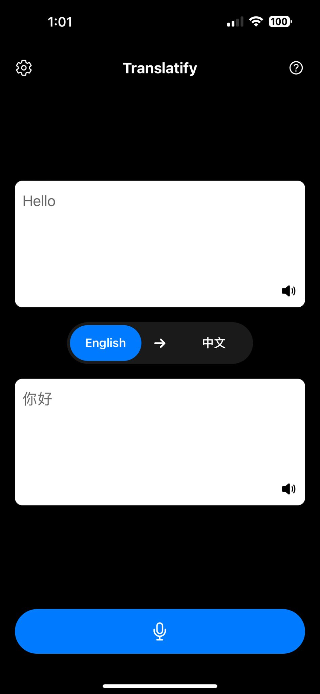
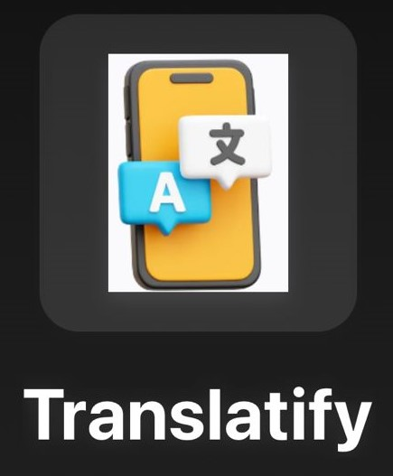
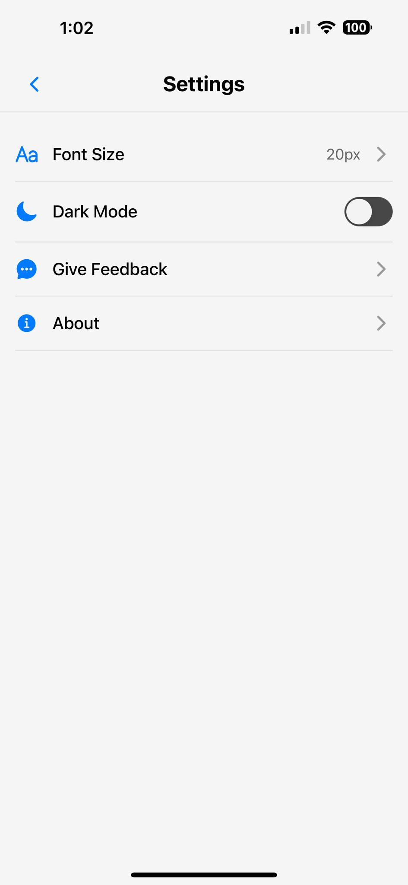

# Translatify - Real-Time Translation Solution

[](https://reactnative.dev/)

Translatify is an innovative, early-stage prototype designed to facilitate real-time translation for elderly immigrant parents who face communication barriers. It aims to bridge generational and linguistic gaps by offering a simple, user-friendly interface that translates conversations in real time, making it easier for families to connect and understand each other.

---

## Table of Contents

1. [Features](#features)
2. [Snapshots](#snapshots)
3. [Installation](#installation)
4. [Usage](#usage)
5. [Project Structure](#project-structure)
6. [Technology Stack](#technology-stack)
7. [Ethics, Security, and Privacy](#ethics-security-and-privacy)
8. [External Sources and Attribution](#external-sources-and-attribution)
9. [Support](#support)

---

## Features

- **Real-time Audio Translation**: Seamless translation between English and Chinese during conversations.
- **Context Aware Translations**: Better translation between different languages during conversations without loss of context.
- **User-friendly Interface**: Clean, high-contrast design for improved usability, especially for elderly users.
- **Dark Mode**: Customizable display settings to reduce eye strain.
- **Adjustable Font Size**: Enhanced readability with adjustable text sizes.
- **Seamless Language Switching**: Easy toggle between English and Chinese translations.

---

## Snapshots

### 1. **Main Translation Interface**


The main interface showcases real-time translation between English and Chinese. It features:
- Clear, high-contrast text boxes for input and output
- Language selection toggle
- Microphone button for voice input
- Audio playback options for both languages

### 2. **App Icon**


The Translatify app icon features a stylized smartphone with "A" and Chinese character speech bubbles, representing the app's bilingual translation capability.

### 3. **Settings Screen**


The settings screen allows users to customize their experience with options including:
- Font size adjustment
- Dark mode toggle
- Feedback submission
- Access to app information


---

## Installation

### Prerequisites

- Node.js (v14.0.0 or later)
- npm (v6.0.0 or later)
- Expo CLI (`npm install -g expo-cli`)
- OpenAI API key

### Step-by-Step Installation

1. Clone the repository:
   ```bash
   git clone https://github.com/LargePenguin034/Elderly-Immigrant-Integration
   cd Elderly-Immigrant-Integration
   ```

2. Install dependencies:
   ```bash
   npm install
   ```

3. Configure environment variables:
   Create a `.env` file in the `backend` folder with the following content:
   ```
   GOOGLE_APPLICATION_CREDENTIALS=nimble-answer-434823-u3-2c626702566e.json
   OPEN_API_KEY=your_openai_api_key
   ```
   Replace the placeholders with your actual credentials.

4. Use own IP address:
   Edit a `app.json` file in the folder with the following content:
   ```bash
   "WEB_SOCKET": "ws://Your.IPV4.Address:8080"
   ```
   Find your IPv4 Address:
   -  On Windows: Open the command prompt (cmd) and type: ```ipconfig``` 
   -  On macOS/Linux: Open your terminal and run the following command:
   ```ifconfig | grep inet   ``` 
4. Start the backend server:
   ```bash
   node backend/server
   ```

5. In a new terminal, start the Expo development server:
   ```bash
   npx expo start
   ```

6. Scan the QR code with the Expo Go app on your mobile device, or use an emulator to run the application.

For detailed instructions on using the app, please refer to our app tutorial option on the main screen.

---
## Usage

1. Open the Translatify app on your device.
2. Select the desired translation direction (English to Chinese or vice versa) using the language toggle.
3. Speak into the device or type your text in the input box.
4. View the real-time translation in the output box.
5. Use the audio playback buttons to hear the translated text if needed.
6. Access the settings menu to customize the app according to your preferences.

---

## Project Structure

Our codebase is exceptionally well architected, demonstrating excellent software development practices and quality. Here's an overview of the project structure:

```
translatify/
├── app/
│   ├── _layout.tsx       # App layout component
│   ├── index.tsx         # Main entry point
│   ├── settings.js       # App configuration
│   ├── SplashScreen.js   # Splash screen component
│   └── styles.js         # Global styles
├── assets/               # Static assets (images, fonts)
├── backend/
│   ├── context.js        # OpenAI API integration
│   └── server.js         # WebSocket server for real-time translation
├── components/
│   ├── navigation/       # Navigation components
│   ├── apis.js           # API utility functions
│   ├── audioUtils.js     # Audio recording and streaming
└── [Other configuration files]
```

## Technology Stack

- **Frontend**: React Native
- **Backend**: Node.js
- **APIs**: Google Cloud Speech-to-Text, OpenAI GPT
- **Development Platform**: Expo

---

## Ethics, Security, and Privacy

Translatify prioritizes the ethical management of user data. All audio and text are securely processed through OpenAI and Google Cloud, ensuring privacy is maintained. No personally identifiable information is stored or shared. The development team has carefully addressed ethical concerns, aiming to meet top industry standards for security and data protection.

---

## External Sources and Attribution

Our project relies on these key technologies:

- Google Cloud Speech-to-Text API
- OpenAI GPT-4
- Expo framework
- React Native


---

## Support

For issues or questions about Translatify, please open an issue on our [GitHub repository](https://github.com/LargePenguin034/Elderly-Immigrant-Integration/issues) or contact our support team through the **Give Feedback** option in the app's settings.


---
